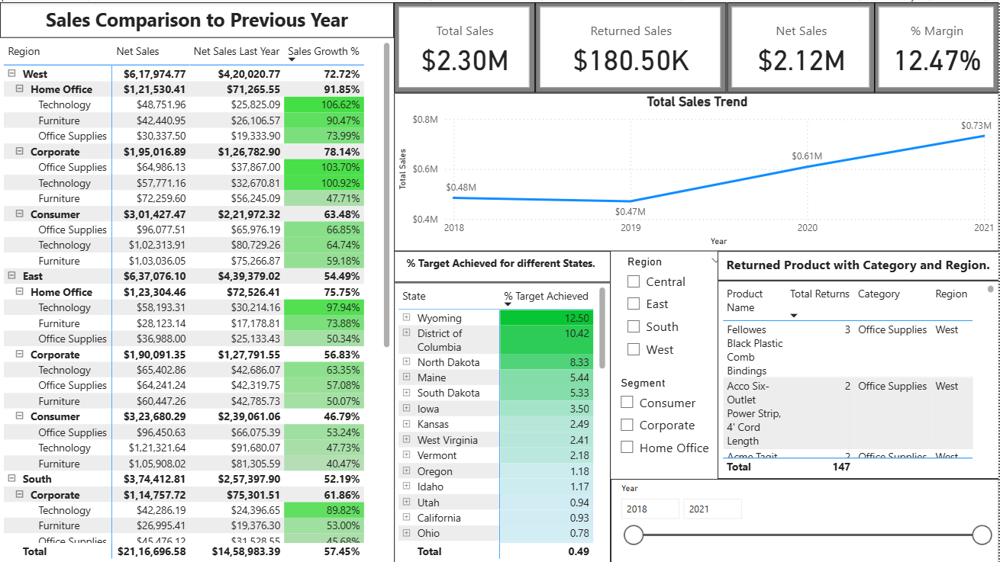
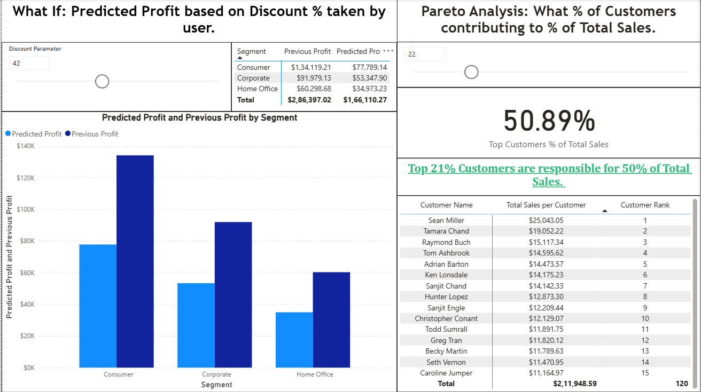
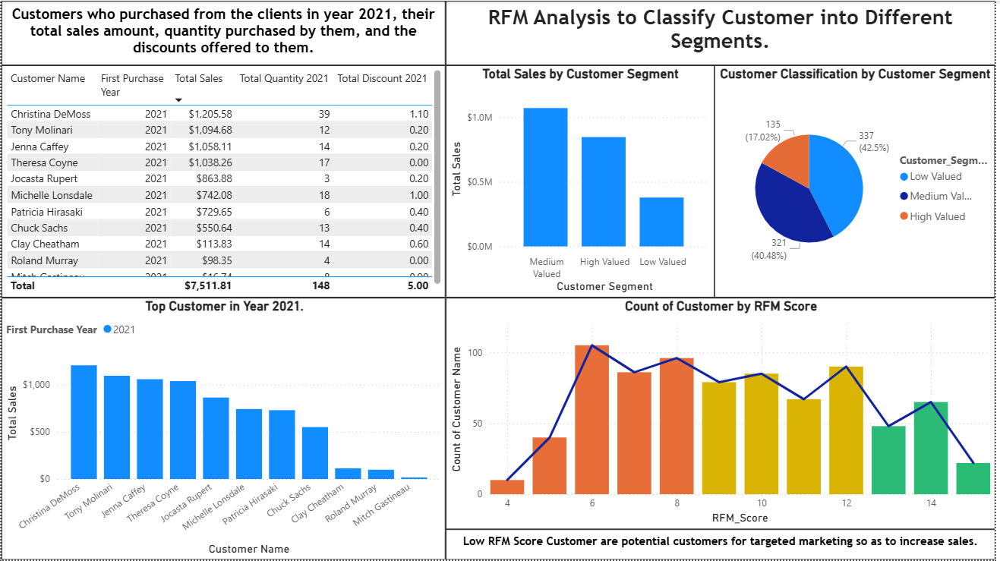
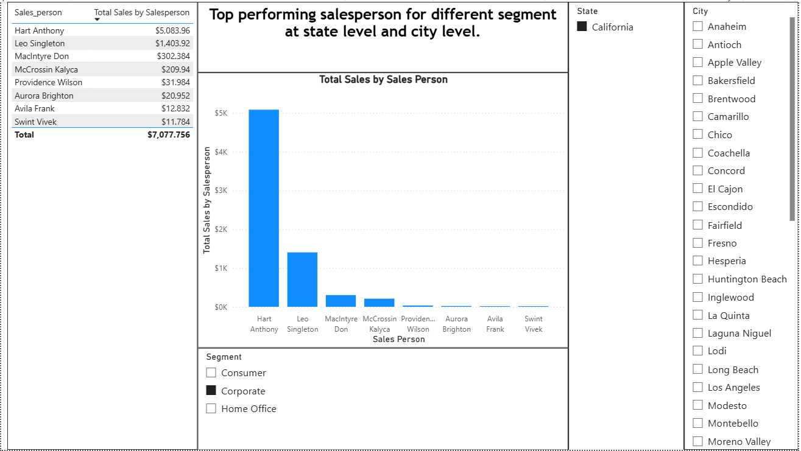
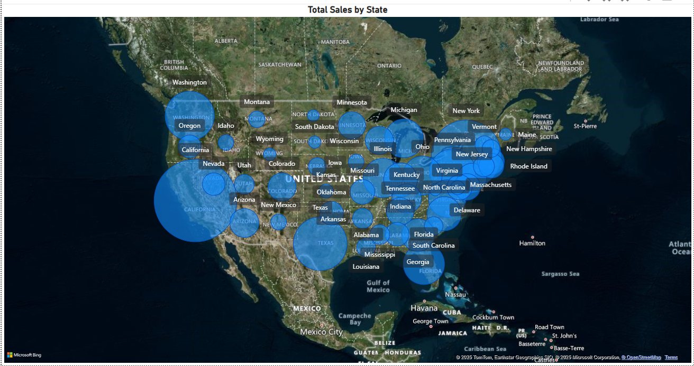

# US Sales Analytics Dashboard (Power BI)

## 📌 Project Overview
This project is a **Power BI Sales Analytics Dashboard** built on a retail dataset to analyze **sales performance, customer behavior, product returns, and profitability**.  
It highlights **KPIs, trends, customer segmentation, and regional performance**, helping decision-makers identify growth opportunities and problem areas.  

The dashboard contains **5 pages** with interactive visuals and insights.  

---

## 📊 Dataset Details
The dataset consists of multiple relational tables:

- **Orders Table**: Order ID, Date, Year, Ship Mode, Segment, Country, State, Region, Product ID, Sales, Quantity, Discount, Profit, Salesperson ID  
- **Salesperson Table**: Salesperson ID, Name  
- **Sales Target Table**: State, Year, Month, Target  
- **Products Table**: Category, Sub-Category, Product Name, Product ID  
- **Customer Table**: Customer ID, Customer Name  
- **Return Table**: Order ID, Returned   
- **Region Heads Table**: Person, Region  

---

## 📈 Dashboard Pages & Features

### 🔹 **Page 1 – Sales Overview**
- KPIs: **Total Sales ($2.3M), Returned Sales, Net Sales($2.12M), % Margin(12.5%)**  
- **Yearly Toatal Sales Trend** (2018–2021)  
- **Sales vs Previous Year Growth %** across regions, segments, and categories  
- **Target Achievement** by state  
- **Returned Products Analysis** by category & region  

---

### 🔹 **Page 2 – What-If & Pareto Analysis**
- **What-If Analysis**: Predicted Profit based on user-defined Discount %  
- Comparison of **Predicted vs Previous Profit** by segment  
- **Pareto Analysis**: Identifies what % of customers contribute to what % of total sales  
  - *Top 21% customers contribute to 50% of sales*  

---

### 🔹 **Page 3 – RFM Customer Segmentation**
- **RFM Analysis** based on Recency, Frequency, and Monetary Value  
- Customers segmented into **Low, Medium, and High Valued** groups  
- Visuals:  
  - Sales by customer segment  
  - Pie chart for customer classification  
  - RFM Score distribution  
- **Customer-level details**: sales, purchase frequency, discount  

---

### 🔹 **Page 4 – Salesperson Performance**
- Top 5 performing salespersons at **state & city level**  
- Sales per salesperson with average discount offered  
- Drill-down filters: Region, State, Segment, City  

---

### 🔹 **Page 5 – Geo Analysis**
- **US Map with Bubble Chart**  
- State-wise sales visualization to identify high & low-performing regions  

---

## 🚀 Key Insights
- **West Region – Home Office segment** achieved **91.85% sales growth** YoY.  
- Certain products (e.g., *Black Plastic Comb Bindings*) had **highest return counts**.  
- **Top 21% of customers** drove **50% of sales revenue**.  
- RFM analysis helped classify **337 Medium Valued, 321 High Valued, and 135 Low Valued** customers.  
- **California & Texas** dominated sales, while smaller states lagged behind.  
- Salesperson performance varies widely, with a few individuals contributing the majority of sales.  

---

## 🛠 Tools Used
- **Power BI Desktop** – Data Modeling, DAX, Visualizations  
- **Power Query** – Data Cleaning & Transformation  
- **DAX Measures** – Calculations for KPIs, What-If, Pareto, RFM  

---

## 📷 Dashboard Preview

---

## 📂 How to Use
1. Clone/download the repo  
2. Open the `.pbix` file in **Power BI Desktop**  
3. Interact with filters, slicers, and What-If parameters  

---

## 👤 Author
**Swapnil Prasad**  
📍 Hyderabad, India  
🔗 [GitHub Profile]([(https://github.com/swapnilprasad69)])  
🔗 [LinkedIn]([(https://www.linkedin.com/in/swapnil-prasad-387295178)])  

